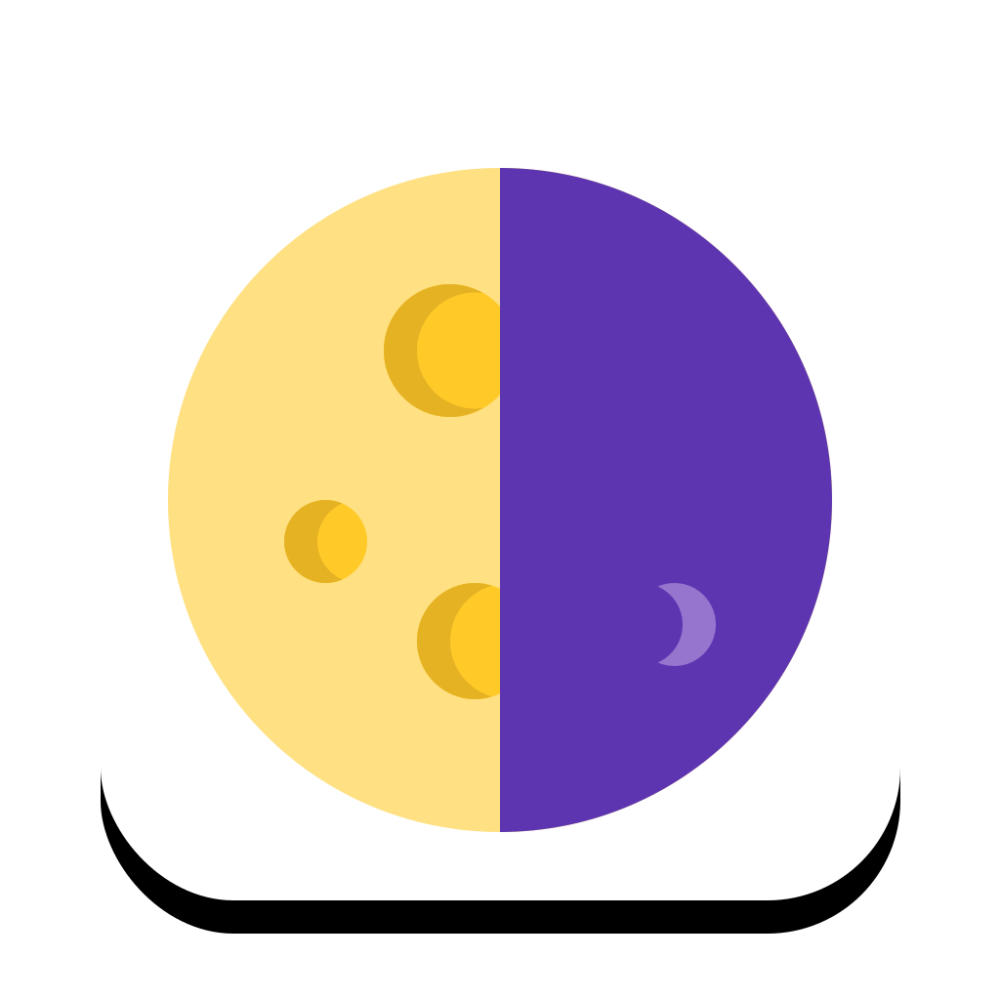
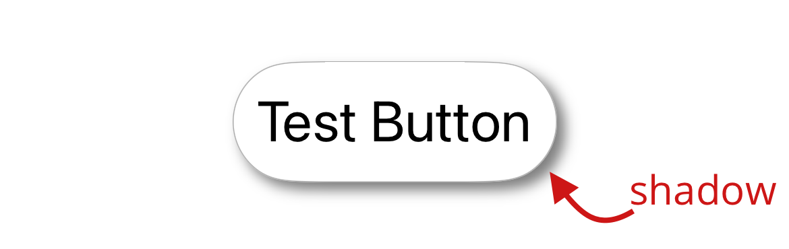
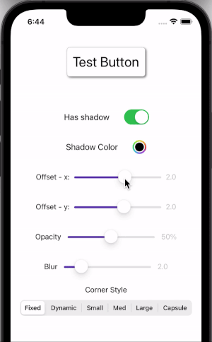

  

    
    

# umbra

Umbra app demonstrates how to add shadow effect to buttons with rounded-corners (UIButton). Umbra uses CALayer in Core Animation to achieve this visual effect. The example app supports both [UIButton.Configuration](https://developer.apple.com/documentation/uikit/uibutton/configuration) api that was introduced with iOS 15 as well as the old API where developer was required to adjust UIButton's backing layers to create rounded corner effect.

  

Download and run the example app to see how to control the shadow effect to your specifications. To achieve the same affect on your own UIButtons, check out the [UmbraButton.swift](./umbra/UmbraButton.swift) file that uses the UIButton.Configuration API. If your project is not using this API yet then inspect [UmbraButtonOldApi.swift](./umbra/UmbraButtonOldApi.swift) instead. Use it as-is or subclass UIButton in your own project and copy the relevant code according to your needs.

## Demo

  

